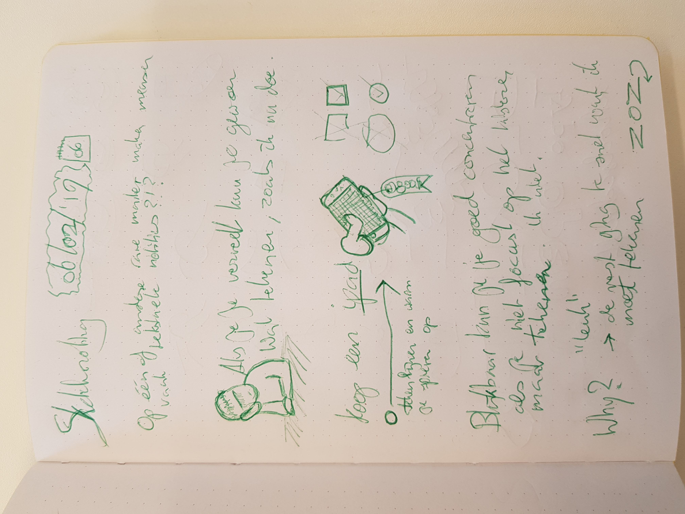
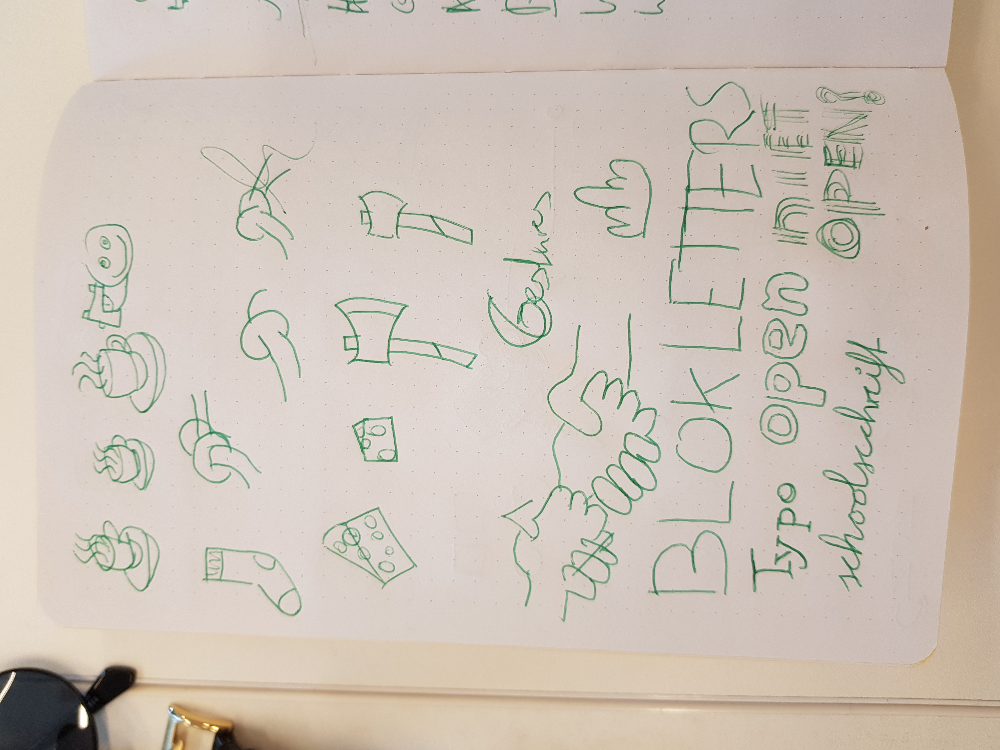
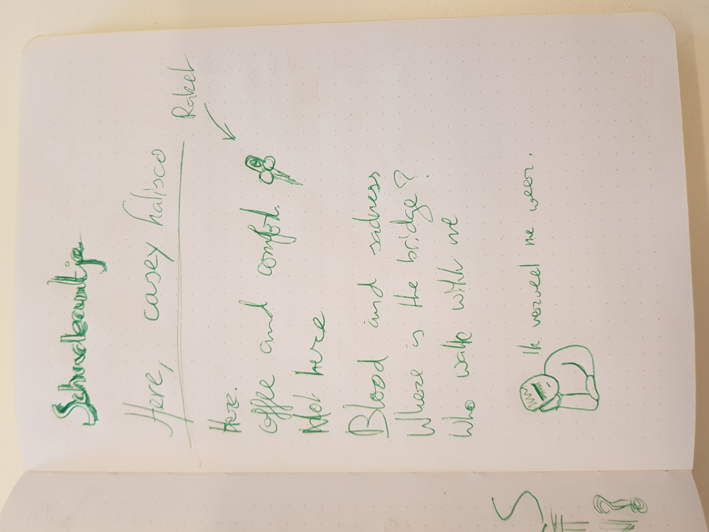
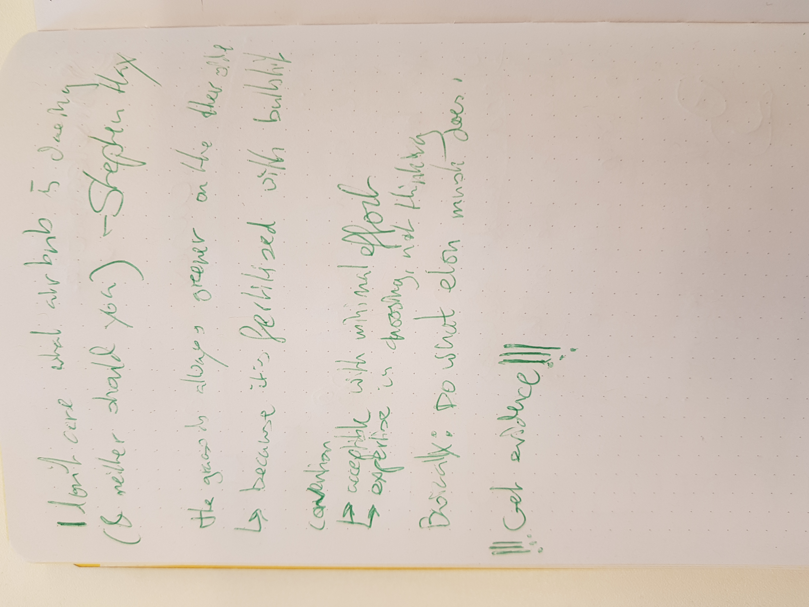
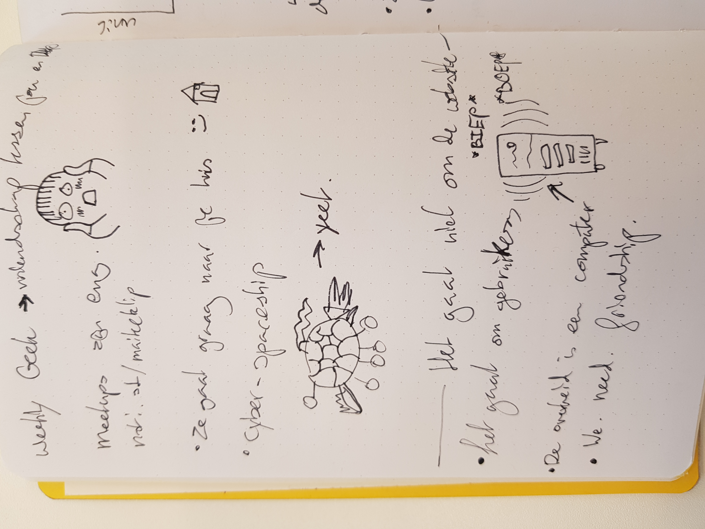
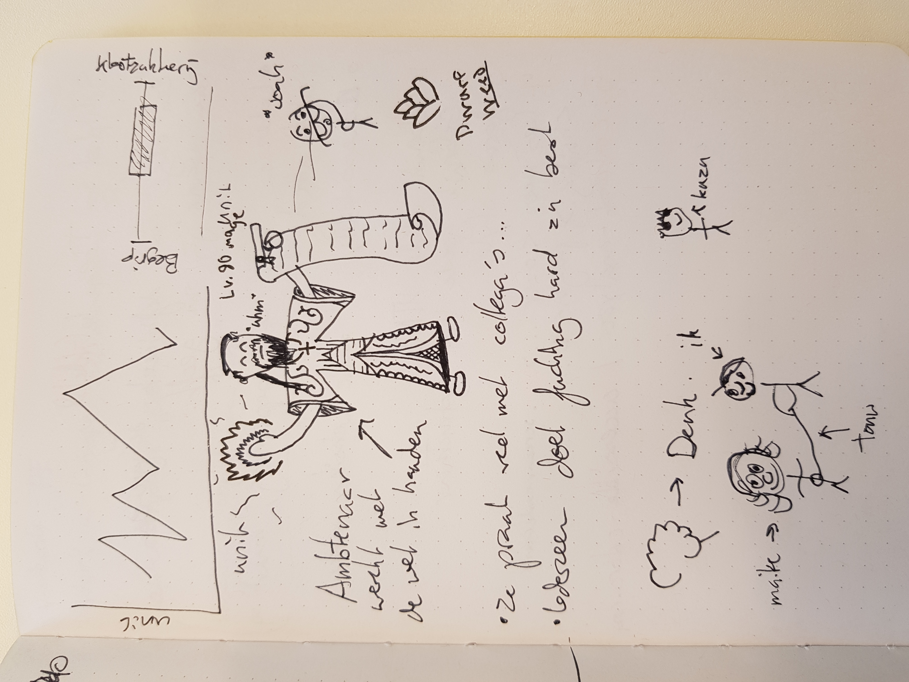
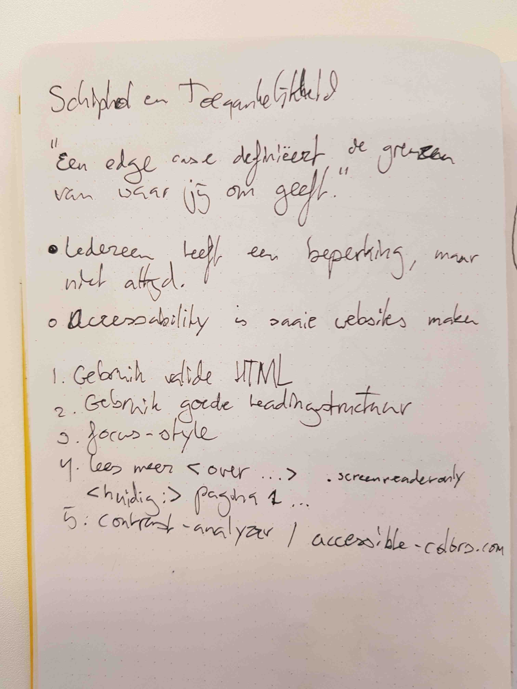
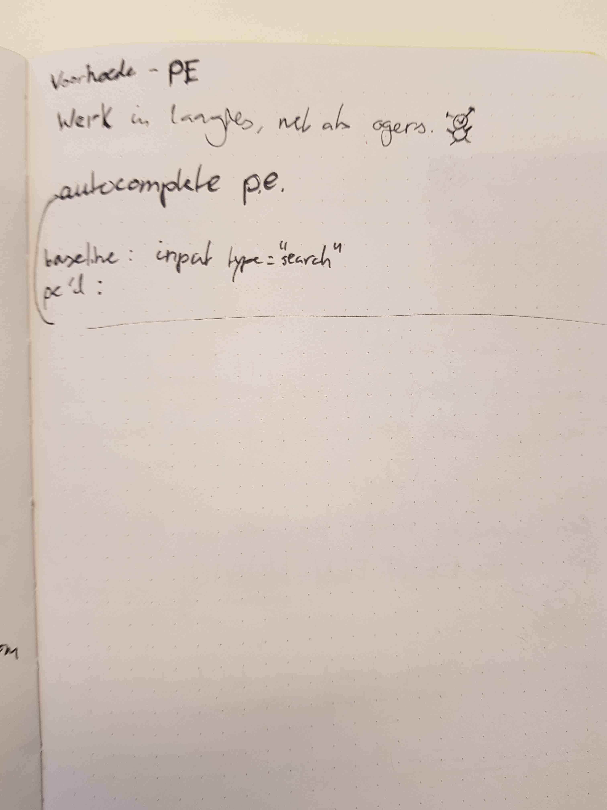
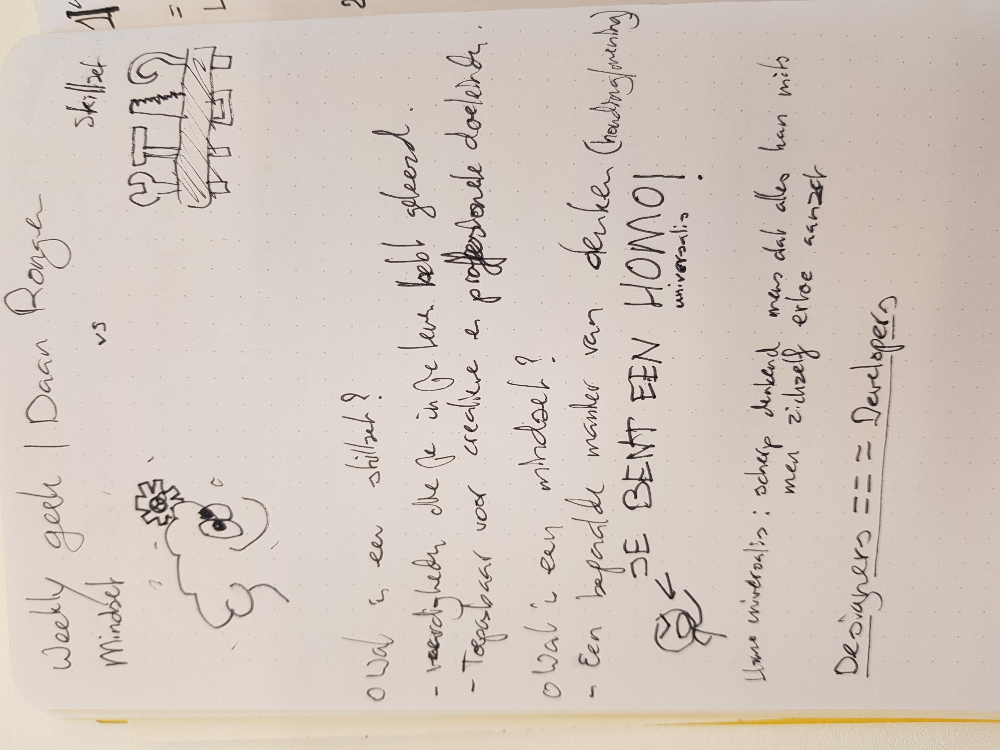
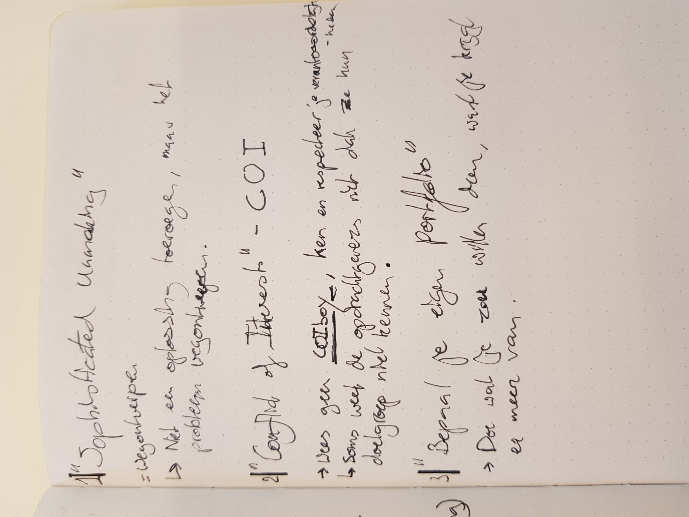

# Weekly Nerd @cmda-minor-web · 2018-2019

## Articles
1) [You Are Not a Real Programmer](https://medium.com/@maanlampje/i-am-not-a-real-programmer-ae46f70934ce)

2) [Creating the new jQuery](https://medium.com/@maanlampje/creating-the-new-jquery-98fe8181f18d)

3) [Paradigmatic Paradoxes in Coding](https://medium.com/@maanlampje/paradigmatic-paradoxes-in-coding-1e85c3ab70b1)

## Weekly Mingle

  
Click here to view mingle summaries

  ### ICATT
  De eerste weekly mingle vond plaats bij ICATT. We werden ontvangen door een Business Unit Manager, frontender, backender en de directeur.

  Ze begonnen het gesprek met een presentatie over hoe zij een opdracht omzetten van idee tot werkend product. Ze bleken veelal head-first te beginnen, maar sinds kort hadden ze besloten om eerst een uitgebreid ontwerpproces te starten voordat ze aan het ontwikkelen zloegen.

  Aan het einde mochten we een elevator pitch houden over wat wij wilden bereiken in onze carrières, waarin ik zei dat ik de wereld *ten goede* wil veranderen.

  ### Lifely
  Bij lifely vertelden ze vooral hoe zij scrum toepassen bij het realiseren van een project. Daarnaast werden we geattendeerd op hoe belangrijk het is voor een stagezoekende student om een goede portfolio te hebben -- dat gold ook voor toekomstige werknemers.

  ### Dept
  Bij dept draaide alles om componenten. Ze gebruikten allerlei verschillende frameworks, maar elk framework kon gebruik maken van hun persoonlijke "componentenkluis".

  In hun presentatie kregen we een klein voorbeeld van hoeveel componenten er eigenljik in een website zitten; we werden (on?)aangenaam verrast.

  De mingle werd afgesloten met een rondleiding door het gebouw -- dat zag er erg mooi uit.

  ### Elastique
  Elastique ligt in Hilversum, dus dat was bij mij om de hoek!

  De mingle begon met een rondleiding door het gebouw. Daarna werd verteld wat Elastique doet, wat *alles* blijkt te zijn. Ze hebben veel verschillende developers in dienst; front- & backenders, UI & UX en iOS & android developers.

  Een gaaf en groot bedrijf, wat gelijk ook wel een beetje een tegenvaller was, want ik kreeg niet het gevoel dat ik daar impact kon maken op de wereld. Meer één van de zoveel werknemers.

  ### Valtech
  Valtech is een bedrijf dat niet alleen in Nederland gestationeerd is; alle kantoren hebben hun eigen specialiteiten.

  We werden ontvangen door een nieuwe werknemer, waarmee wij kort hebben gepraat over wat het inhoud om developer te zijn voor Valtech.

  De persoon die ons daarna meenam voor een rondleiding had in de file gestaan. Na de rondleiding zijn we gaan zitten en kregen we een korte uitleg over wat het betekende om als developer te werken voor Valtech. De man die ons te woord stond had zelf als backender gesolliciteerd, maar had tijdenz zijn werk uitgevonden dat hij zich beter op zijn plaats voelde als frontender.

  ### Mirabeau
  We waren al op deze locatie geweest voor een voorgaand project, dus ik wist al hoe het allemaal inelkaar zat. Ik had al niet zo'n geweldig gevoel bij dit bedrijf (geen respect voor privacy en vooral "big data om de big data"), en dat werd niet beter. de mensen die ons te woord stonden hadden geen presentatie voorbereid en wij moesten maar vragen wat we wilden weten. Op zich niet verkeerd, maar ik was er al geweest en ik moet eerlijk zeggen dat ik niet heel geïnteresserd was over de details van hun werk.

  ### Q42
  We werden door twee werknemers meegenomen naar een kantoorruimte waarin we een presentatie kregen over wat Q42 doet en waar ze voor staan. Het bleek een best leuk bedrijf met interessant werkdynamiek: je had enigszins de vrijheid om te keizen waaraan je wilt (of niet wilt) werken, en tussen de opdrachten door maakten ze zelfs expliciet tijd vrij voor persoonlijke projecten die, mits ze leuk zijn, misschien wel verder ontwikkeld mogen worden onder werktijd.

  Ze vertelden wat over hun projecten, en ik heb het met ze gehad over de ethiek van klanten zoals de Staatsloterij, die zij vroeger wel als klant hadden. Het was fijn te horen dat mensen dezelfde mening hebben als ik, en dat daar de ruimte voor was bij Q42.

  Het enige jammer was dat ze helemaal geen design zelf doen -- het zijn alleen engineers/developers. Ik zou ook wel graag wat met design willen doen als ik stage moet lopen of werken.

  ### Matise
  Matise had een hele leuke locatie. We kwamen binnen en konden over een gracht rechtstreeks naar olifantenkonten kijken in Artis. Het was een klein pand, en er liepen veel honden -- op zich geen probleem, maar het rook ook ontzettend naar (natte) hond...

  De presentatie die zij hielden was kort maar krachtig, ze sloegen veel slides over met de reden dat "ze het nu al zo vaak gedaan hadden". Dat voelde een beetje raar, want er zaten daardoor allemaal gaten in het verhaal.

  Als laatste vroegen ze ons mee te denken aan één van hun aankomende opdrachten. Aan de ene kant was dat een leuke en unieke opdracht, maar aan de andere kant voel je je dan wel weer de typische stagiar die ontbetaald werk voor anderen doet.

  Het was een interessant bedrijf, maar nadat ik hoorde dat ze voor elke opdracht (hoe klein dan ook) gelijk grepen naar Vue, en er weinig aandachty werd besteed aan accessibility (want dat zou extra geld kosten?), leek het me niet de beste plek om stage te lopen of te werken.

## Weekly Geek

  
Click here to view sketchnotes

  ### Sketchnotes met Maaike van Cruchten en Brit Wijnmaalen CMD
  
  
  

  ### Stephan Hay over Design Patterns
  

  ### Cyd Stumpel (ex) & Dennis Spierenburg (ex) over werken als Frontender bij Matise
  Was ik helaas niet bij.

  ### Maike Klip over ontwerpen voor vluchtelingen CMD ICONS
  
  

  ### Ischa Gast over A11y Schiphol
  

  ### Workshop PE de Voorhoede
  

  ### Daan Rongen over afstuderen en je eigen signatuur behouden
  
  

